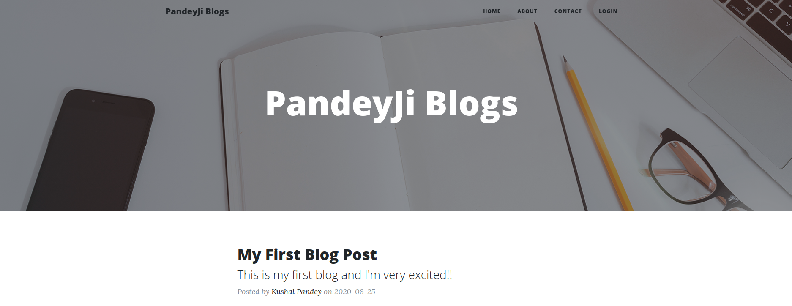

### Create your own Blogging Website
 

    

## Features
* Adim page to manage the blogs i.e add/edit/delete blog posts on the website.
* Upload background image as per the post theme to make blog visually appealing to readers.
* Get notifications via email from readers regarding their queries.

## Built with

#### Frontend
* [HTML](https://developer.mozilla.org/en-US/docs/Web/HTML)
* [CSS](https://developer.mozilla.org/en-US/docs/Web/CSS)
* [Bootstrap](https://getbootstrap.com)
* [JavaScript](https://developer.mozilla.org/en-US/docs/Web/JavaScript)

#### Backend
* [Python](https://www.python.org/)
* [Flask](https://palletsprojects.com/p/flask/)

## Requirements
Setup LAMP stack using this [link](https://www.digitalocean.com/community/tutorials/how-to-install-linux-apache-mysql-php-lamp-stack-ubuntu-18-04#step-4-%E2%80%94-setting-up-virtual-hosts-(recommended)).

Install Python dependencies using:

`pip install -r requirements.txt`

